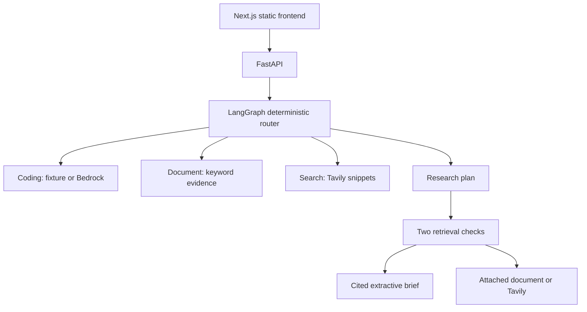
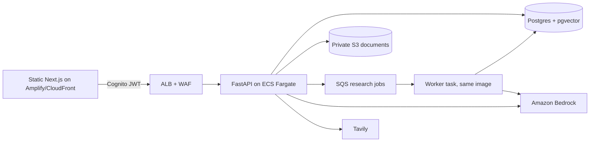

# ADDA AI architecture

## NOW — implemented local MVP

The frontend and API are separate runtimes. Specialist nodes share the API process. Auto routing uses explicit keyword rules; users can override the selection. It is not an LLM classifier. Research is a real multi-step LangGraph path, with deterministic planning and excerpt assembly rather than model synthesis.

`POST /api/chat` accepts `message`, `agent` and optional `document_id`. Document requests also require `X-Document-Token`; a configured demo gate requires `X-Demo-Token`. Responses include request ID, selected agent, actual provider, answer, completed activity and citations. Read generated OpenAPI for exact schemas. Activity arrives after completion, not as a live stream or private model reasoning.

`POST /api/documents` ingests a multipart file. `POST /api/documents/demo` loads the supplied three-page fictional PDF. `DELETE /api/documents/{document_id}` requires the document token. Tokens are separate from IDs and uploads are isolated by possession of that secret; this is not a full user-account system.

| Specialist | Source and processing | Honest output |
| --- | --- | --- |
| Coding | Fixed offline fixture, or Bedrock Converse when configured | Clearly labeled sample or model response; code never executed |
| Document | pypdf extraction, page-local chunks and weighted keyword matching | Up to three supporting excerpts, each at most 500 characters, with filename/page citations |
| Search | Tavily, up to five result URLs/snippets | Retrieved evidence; full pages not independently verified |
| Research | Two bounded retrieval checks against an attached document, otherwise Tavily | Deduplicated cited evidence brief; no inferred conclusion or AI synthesis |

Document limits: 5 MB upload, 30 PDF pages, 200,000 extracted characters, 300 chunks and 2 MB decompression/output limits for supported PDF stream paths. Reject encrypted, malformed and image-only PDFs. TXT is UTF-8 and treated as one page. Summary requests return representative page excerpts; unmatched queries abstain. Keyword matches do not establish that a passage answers every part of a question.

Documents stay in process memory, expire after one hour, and are capped at ten. Restarting loses uploads. The UI keeps task history and document attachment state in memory, not durable conversation storage. Run one API process for the document demo.

Health advertises configured capabilities and Coding provider; successful responses carry the actual provider. Neither the presence of a key nor a health response verifies a live service. `GET /ready` performs dependency checks (bucket access, provider configuration) and returns 503 with the failing checks.

### Request pipeline and API contract

Middleware order (outermost first): `RequestContext` (request id, timing, JSON access log, security headers) → `RateLimit` (per-client, mutating `/api/*` only) → `BodyLimit` → CORS → routes. Every response carries `X-Request-ID`; clients may supply their own (8–64 chars `[A-Za-z0-9._-]`) for tracing.

Errors share one shape: `{"detail": {"code", "message", "request_id"}}`. Codes are part of the contract:

| Code | Status | Meaning |
| --- | --- | --- |
| `invalid_request` | 422 | Schema violation (blank/oversized message, unknown field, bad agent) |
| `request_too_large` | 413 | Body over 64 KB (chat) or 5 MB + 128 KB (upload) |
| `unauthorized` | 401 | Demo token missing or wrong |
| `rate_limited` | 429 | Per-client window exhausted; `Retry-After` header |
| `documents_disabled` | 503 | Document storage off in this deployment |
| `provider_unavailable`, `aws_*` | 502/503 | Upstream model/search failure; never falls back to the fixture |
| `internal_error` | 500 | Unhandled exception; details only in logs under the request id |

Startup guards (`Settings.validate_for_environment`): production refuses the demo fixture unless `ALLOW_DEMO_FIXTURE=true`, requires https origins and a Bedrock model id when `NEXUS_PROVIDER=bedrock`. Interactive docs are disabled in production.

## TARGET — production architecture (ADRs 0001–0005)

Decisions and trade-offs live in `docs/adr/`; sequencing in `docs/ROADMAP.md`.

## NEXT — verify integrations and deploy an honest subset

Verify two Bedrock requests with the named AWS profile when model access is available. Preserve the working no-key local document path. Amplify + SAM are deployed in `ap-south-1` (`adda-ai-demo`); the Lambda path stores extracted document evidence in a private one-day S3 bucket (`DOCUMENT_ENABLED=true`). Do not present semantic RAG or live Bedrock Coding as current capabilities.

API Gateway HTTP API has a 30-second integration limit; the prepared Lambda budget is 28 seconds. Research currently performs two sequential lookups, so measure its complete latency before enabling it publicly. [AWS HTTP API quotas](https://docs.aws.amazon.com/apigateway/latest/developerguide/http-api-quotas.html)

## LATER — shared storage and semantic RAG

Add private S3 originals, bounded signed uploads, durable document metadata and ownership checks. Introduce a verified embedding model and vector store only after current deployment is stable. Qdrant/S3/embedding environment placeholders do not mean those integrations exist. Async jobs are a future option if ingestion or expanded Research exceeds the HTTP deadline.

No fine-tuning, Kubernetes, Redis, agent-per-service deployment or code execution. Retrieved files/pages remain untrusted evidence. LangGraph provides graph execution; the application owns its state and limits. [LangGraph reference](https://reference.langchain.com/python/langgraph/overview)
